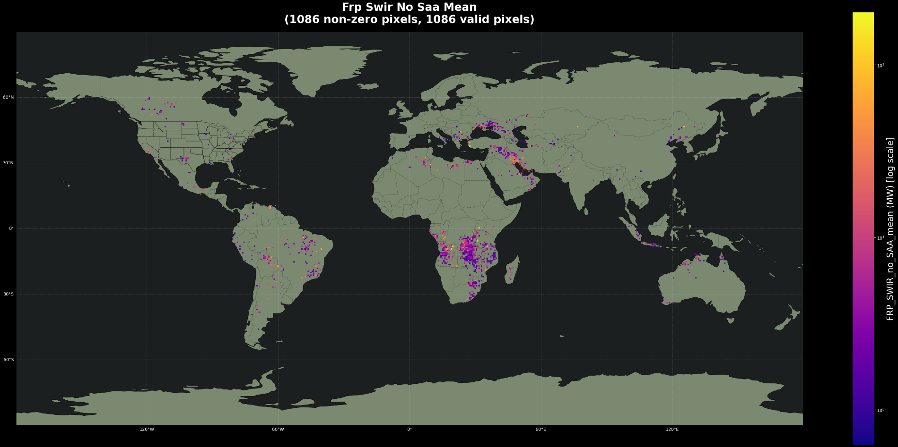

# wekeo

[**Quickstart**](#Usage)
| [**Install guide**](#installation)

## Introduction

Fire Radiative Power Level3
wekeo eumetsat project 

## Preview


---



---

## Installation

### Using pip
```bash
pip install -e .
```

### Using pixi
```bash
pixi install
```

### Prerequisites

#### WEKEO HDA Credentials
You need to set up your WEKEO Harmonized Data Access (HDA) credentials in a file `~/.hdarc`

Required syntax:
```
user:your_username
password:your_password
```


#### Environment Variables
Create a `.env` file in the project root directory with the following environment variables: DIR_ANCILLARY, OUTPUT_DIR

Example `.env` file:
```
DIR_ANCILLARY=/mnt/ceph/proj/WEKEO/ancillary
OUTPUT_DIR=/mnt/ceph/proj/WEKEO/outputs/
```

These variables define paths for storing downloaded data and generated outputs. The directories will be created automatically if they don't exist.

## Usage

The project includes two main Jupyter notebooks located in the `notebooks/` directory:

### level3.ipynb
This notebook performs the FRP total pipeline:
- Downloads and compiles multiple FRP files into a single log event dataset (L2 combinations)
- Saves the compiled log event to NetCDF format
- Computes gridded L3 data (equirectangular projection) from the log events
- Plots the gridded L3 FRP data

### level2.ipynb
This notebook demonstrates basic FRP (Fire Radiative Power) data processing:
- Downloads FRP products for a specified date and area
- Reads specific variables from the downloaded products
- Plots FRP data for both SWIR and MWIR bands

